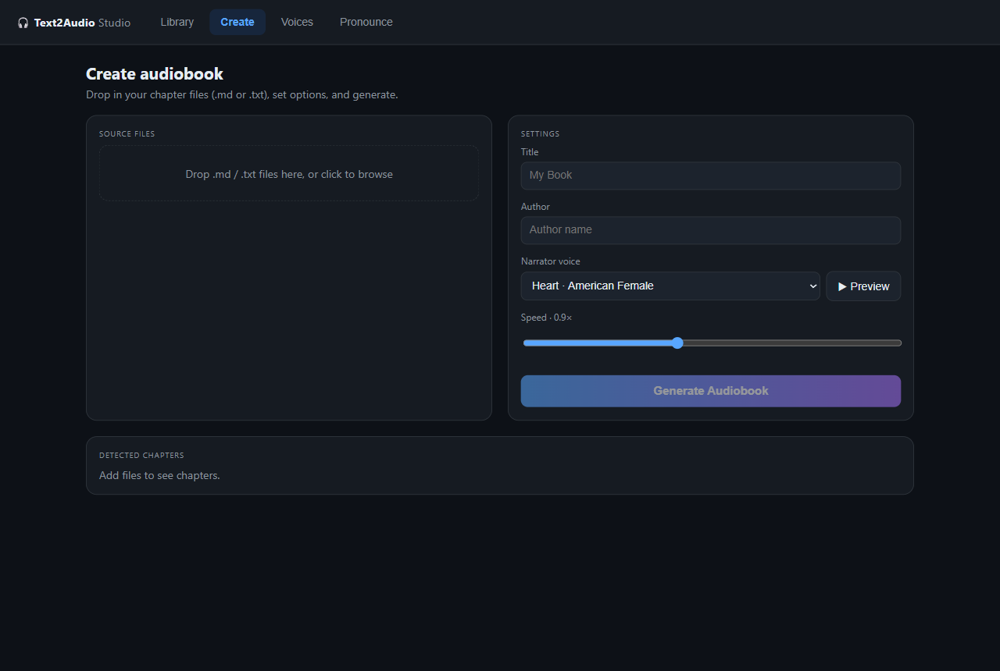
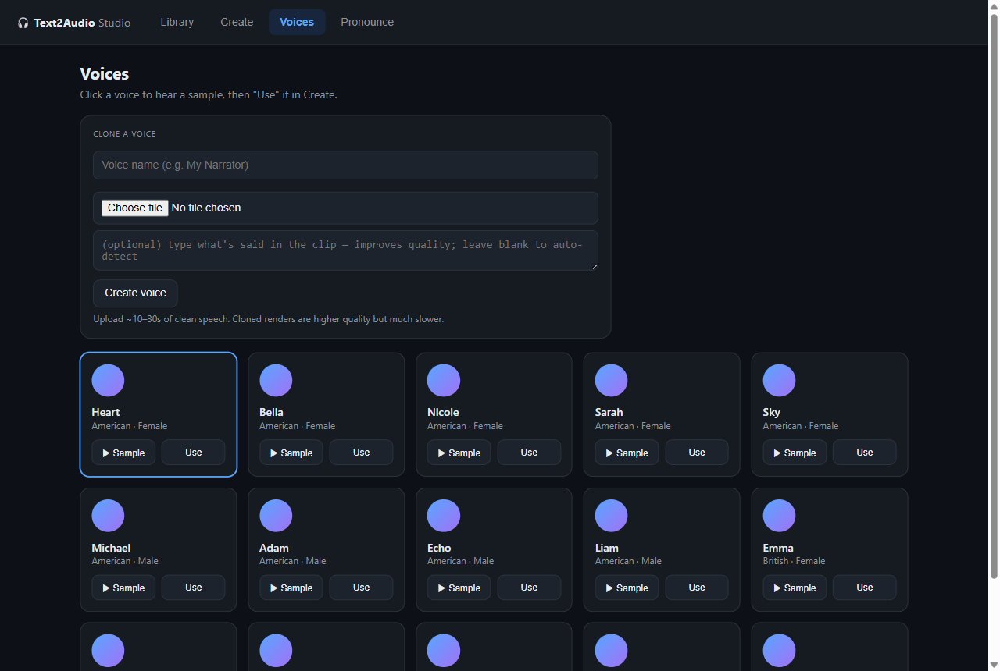
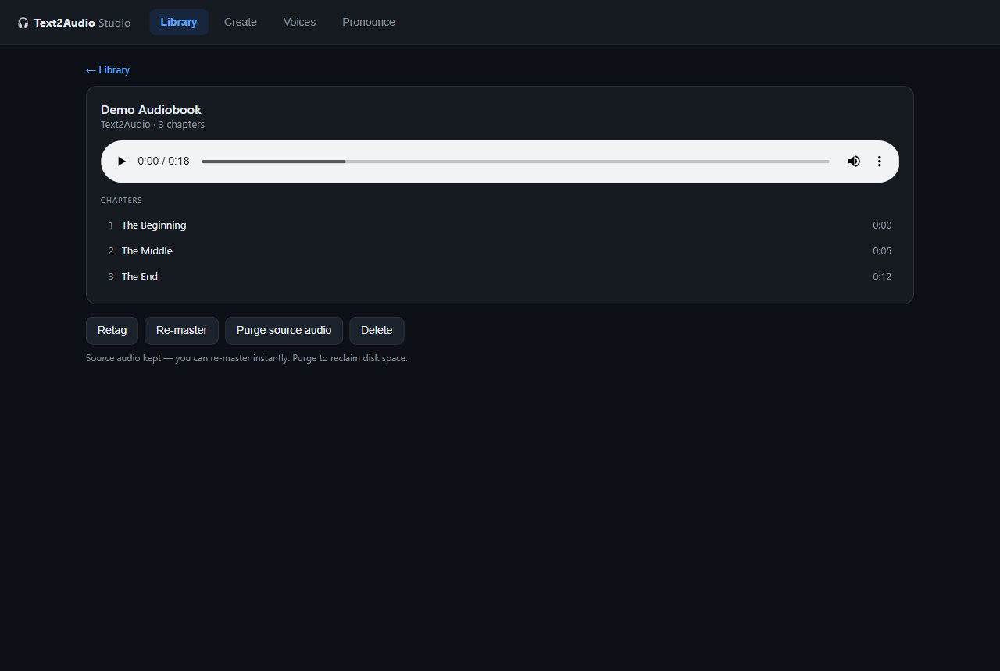
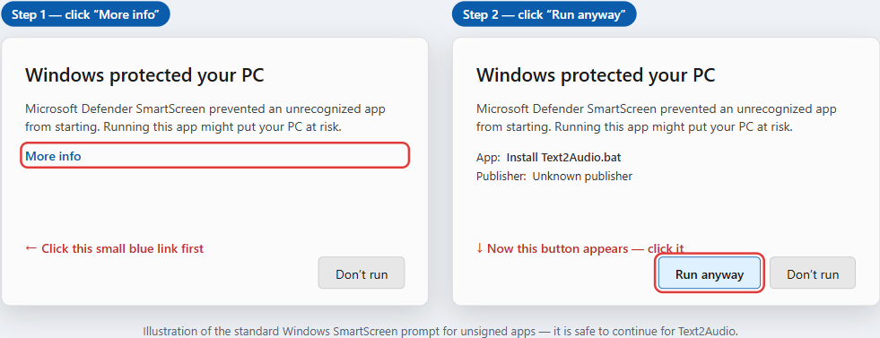

# 🎧 Text2Audio

**Turn a book into a natural-sounding, chaptered audiobook — for free, fully on your own machine.**

[](https://github.com/mooja77/Text2Audio/actions/workflows/ci.yml)
[](LICENSE)

🔊 **[Hear a sample](assets/sample.mp3)** — a short clip narrated by Text2Audio.

Text2Audio is a local, open-source audiobook studio. Drop in your manuscript
(`.txt` or Markdown), pick a narrator, and get a mastered `.m4b` audiobook with
chapter markers — no cloud, no accounts, no per-use cost. It can even **clone a
voice** from a short audio sample.

It runs entirely offline on your own GPU using open text-to-speech models
(Kokoro-82M by default; F5-TTS for voice cloning).

## Screenshots

| Create | Voices &amp; cloning | In-app player |
|:---:|:---:|:---:|
|  |  |  |

---

## 🚀 Quick start (no terminal needed — Windows)

Don't want to touch a command line? On Windows you can be up and running in three steps:

1. **[Download the project as a ZIP](https://github.com/mooja77/Text2Audio/archive/refs/heads/master.zip)** and unzip it somewhere (for example, your Desktop).
2. Double-click **`Install Text2Audio.bat`**. It sets everything up for you — Python, the app and its dependencies, ffmpeg, and espeak-ng. The first run takes a while; just let it finish.
3. Double-click **`Start Text2Audio`** (the installer also adds a shortcut to your Desktop). Your browser opens the Studio — start making audiobooks. Keep the little black window open while you use the app; closing it stops Text2Audio.

> 💡 The first time you generate audio, the voice model (a few hundred MB) downloads automatically. After that, everything runs fully offline.
>
> ⚠️ Windows may show a blue **"Windows protected your PC"** SmartScreen box on the `.bat` files — click **More info → Run anyway** (see below). The scripts are plain text you can open and read first. A full walkthrough, voice-cloning setup, and troubleshooting live in **[INSTALL.md](INSTALL.md)**.



### Install with pip (any OS, for technical users)

```bash
pip install git+https://github.com/mooja77/Text2Audio
text2audio
```

Add the optional voice-cloning engine with the `clone` extra:

```bash
pip install "text2audio[clone] @ git+https://github.com/mooja77/Text2Audio"
```

You'll still need **ffmpeg** and **espeak-ng** installed on your system, and — for GPU
speed — a CUDA build of PyTorch (`pip` pulls the CPU build by default). See
[Setup](#setup) below for the details.

---

## Features

- 📖 **Book → audiobook** — `.txt` / Markdown in, chaptered `.m4b` out (plays in
  Apple Books, Smart AudioBook Player, BookPlayer, etc. with chapter navigation).
- 🖥️ **Studio web UI** — drag-and-drop multi-file import, a voice gallery, live
  per-chapter progress, a built-in chapter player, and a library of your renders.
- 🎚️ **Mastered audio** — 128 kbps AAC, loudness-normalized (~−19 LUFS), high-pass
  filtered, with natural sentence/paragraph pacing. Re-master any book instantly
  (no re-synthesis).
- 🗣️ **Reads text correctly** — expands numbers/abbreviations and an editable
  **pronunciation dictionary** fixes tricky names.
- 🎤 **Voice cloning** (optional) — upload ~10–30 s of speech and narrate in that
  voice, via F5-TTS (runs isolated; Kokoro stays the fast default).
- 🔒 **100% local & free** — your text and audio never leave your machine.

## Requirements

- Windows (developed/tested on Windows 11; should adapt to Linux/macOS) with an
  **NVIDIA GPU** + recent driver (CPU works but is slow).
- **Python 3.10–3.12**
- **[ffmpeg](https://www.gyan.dev/ffmpeg/builds/)** on your `PATH` (provides
  `ffmpeg` and `ffprobe`).
- **[espeak-ng](https://github.com/espeak-ng/espeak-ng/releases)** (Windows `.msi`)
  — phonemizer backend for Kokoro.

## Setup

> Non-technical user on Windows? Skip this — use the
> [Quick start](#-quick-start-no-terminal-needed--windows) above and
> [INSTALL.md](INSTALL.md) instead. The steps below are the manual developer setup.

```powershell
git clone https://github.com/mooja77/Text2Audio.git
cd Text2Audio
python -m venv .venv
.\.venv\Scripts\Activate.ps1
# Install a CUDA build of PyTorch first (pick the index for your CUDA version):
pip install --index-url https://download.pytorch.org/whl/cu124 torch
pip install -r requirements.txt
```

If espeak-ng isn't auto-detected, point to it:

```powershell
setx PHONEMIZER_ESPEAK_LIBRARY "C:\Program Files\eSpeak NG\libespeak-ng.dll"
setx PHONEMIZER_ESPEAK_PATH "C:\Program Files\eSpeak NG\espeak-ng.exe"
```

### Linux / macOS

The project is plain Python and cross-platform. The commands are the same, except:

- Activate the venv with `source .venv/bin/activate`.
- Install ffmpeg and espeak-ng from your package manager:
  - Debian/Ubuntu: `sudo apt install ffmpeg espeak-ng`
  - macOS (Homebrew): `brew install ffmpeg espeak-ng`
- Where this README shows `.\.venv\Scripts\python.exe`, use `.venv/bin/python`.
- Pick the PyTorch index for your platform/accelerator from
  [pytorch.org](https://pytorch.org/get-started/locally/) (e.g. ROCm on Linux, or
  the default CPU/MPS build on macOS — note Kokoro/F5 are much faster on CUDA).

## Run

```powershell
.\.venv\Scripts\python.exe server.py
```

Your browser opens the Studio. **Create** tab: drag in `.md`/`.txt` chapter files
(Markdown is auto-cleaned), set title/voice/speed, and **Generate** — live
per-chapter progress streams as it renders. **Voices**: audition narrators or
clone one. **Library**: every finished audiobook with an in-app chapter player,
re-master, and delete.

> A classic single-screen UI is also available: `python app.py`.

### Chapter markers

For one-file-per-chapter imports, each file's first `# Heading` becomes the
chapter title. For a single `.txt`, put a marker line before each chapter:

```
## Chapter One
Once upon a time...

## Chapter Two
...
```

If there are no markers, it auto-detects `Chapter N` / ALL-CAPS headings, else
treats the whole text as one chapter.

## Voice cloning (optional)

Voice cloning uses **F5-TTS**, a heavier optional engine. Kokoro stays the
default; cloning runs in an isolated subprocess (F5 and Kokoro can't share a
process).

```powershell
.\.venv\Scripts\python.exe -m pip install f5-tts
# f5-tts may pull a mismatched torchaudio — re-pin it to match your torch:
.\.venv\Scripts\python.exe -m pip install "torchaudio==2.6.0" --index-url https://download.pytorch.org/whl/cu124
```

Then in **Voices → Clone a voice**: name it, upload ~10–30 s of clean speech, and
(optionally) paste a transcript of the clip for best quality. The cloned voice
appears alongside the built-ins and in the Create dropdown. Cloned renders are
higher quality but much slower — use **▶ Sample** to audition first.

### ⚠️ Responsible use

Only clone voices you have the right to use — **your own voice, voices you have
explicit permission to clone, or public-domain recordings**. Do not impersonate
people or create deceptive audio. You are responsible for how you use this tool.

## Tests

The suite runs **without a GPU** (the TTS engines are mocked):

```powershell
pytest -q
```

GPU model tests are opt-in: `$env:RUN_KOKORO=1; pytest tests/test_synth.py` and
`$env:RUN_F5=1; pytest tests/test_clone_synth.py`.

## How it works

```
book (.txt/.md) → ingest (clean markdown) → normalize (numbers/abbr/pronunciation)
   → chunk (sentence/paragraph) → synthesize (Kokoro or F5) → assemble (ffmpeg:
   chapters + loudness master) → .m4b in your library/
```

Project layout: `pipeline/` (text→audio), `backend/` (library, jobs, render,
voices, pronunciations), `server.py` (FastAPI + web API), `web/` (vanilla-JS UI).

## Contributing

See [CONTRIBUTING.md](CONTRIBUTING.md). Issues and PRs welcome.

## License

Text2Audio's code is **MIT** (see [LICENSE](LICENSE)). The TTS **models** it
downloads have their own licenses — notably the F5-TTS cloning weights are
**CC-BY-NC (non-commercial)**. See [THIRD_PARTY_LICENSES.md](THIRD_PARTY_LICENSES.md).

## Acknowledgements

- [Kokoro-82M](https://huggingface.co/hexgrad/Kokoro-82M) — default narration
- [F5-TTS](https://github.com/SWivid/F5-TTS) — voice cloning
- ffmpeg, espeak-ng, FastAPI, and the wider open-source ecosystem
